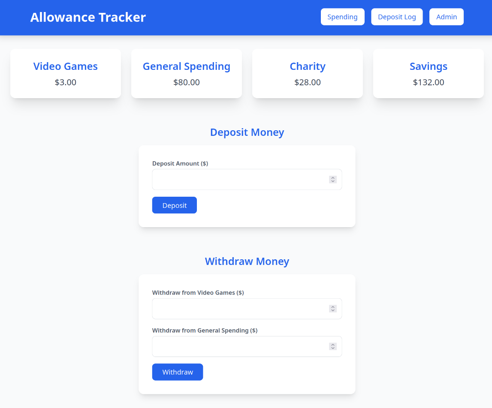

# Allowance Tracker

### Disclaimer
This is a project I built to help my 9 year old track any money recieved.  The tracker will auto split the deposit of funds into 4 categories, ```Video Games```, ```General Spending```, ```Charity```, ```Savings```.  Right now the % split between the categories is hardcoded into the code.  It is working well for me, but I can't guarentee it will work for you.

---
Allowance Tracker is a simple web application designed to help kids (ages 10–18) manage their allowance and spending. The app lets users deposit money—which is automatically split into four categories—and withdraw funds (only from select categories). It also provides visualizations of monthly inflows and outflows, a deposit log, and an administrative settings panel to update or reset the database.




### Features

- Automated Deposit Splitting:
    When a deposit is made, the amount is automatically divided as follows:
   - Video Games: 10%
    -  General Spending: 30%
    - Charity: 20%
     - Savings: 40%

- Withdrawals:
    Withdraw funds from the Video Games and General Spending categories only, with safeguards against overdraw.

- Dashboard:
    View current balances for all categories on an intuitive dashboard.

- Monthly Flow Chart:
    Visualize monthly inflows and outflows for Video Games and General Spending via a grouped bar chart.

- Deposit Log:
    Access a log of all deposits with their dates and amounts.

- Admin Settings Panel:
    Secure the settings panel with a password (default: admin123) to:
	- Update category balances manually.
        Reset the database (which clears balances and deposit logs).
    - Reset includes a confirmation step with a warning: "Are you sure? This action can't be undone."

## Technologies

- Next.js – React framework for building server-rendered web applications.
- Tailwind CSS – Utility-first CSS framework for modern styling.
- Prisma – Next-generation ORM for interacting with a PostgreSQL database.
- PostgreSQL – Database for persistent data storage.
- Chart.js & react-chartjs-2 – Libraries for creating interactive charts.
- Node.js – JavaScript runtime for the backend.
---

### Getting Started
Prerequisites
- Node.js (v14 or higher)
- npm or Yarn
- PostgreSQL – Ensure it’s installed and running.

### Installation
Clone the Repository:
```git clone https://github.com/yourusername/allowance-tracker.git
cd allowance-tracker
```

Install Dependencies:
```
npm install
or
yarn install
```
### Configure Environment Variables:
Create a .env file in the project root and add:
```
DATABASE_URL="postgresql://<db_user>:<db_password>@localhost:5432/<db_name>?schema=public"
NODE_ENV=development

Replace <db_user>, <db_password>, and <db_name> with your PostgreSQL credentials.
````
### Set Up Prisma and Migrate the Database:

```
npx prisma migrate dev --name init
````
This command creates the required tables and schema in your PostgreSQL database.

---

### Running the Application
Development

Start the app in development mode:
```
npm run dev
# or
yarn dev
````
Your app will be available at http://localhost:3000.
Production

### Build the Application:
```
npm run build
# or
yarn build
````

Start the Application:
 ```
npm run start
or
yarn start
```

---
## API Endpoints

- GET /api/balance:
    Returns the current balance for all categories.

- POST /api/deposit:
    Accepts a JSON body with { amount: number } to deposit funds. The deposit is automatically split into the four categories.
-  POST /api/withdraw:
    Accepts a JSON body with { videoGames: number, generalSpending: number } for withdrawals.

- GET /api/monthlyFlow:
    Returns monthly aggregated inflow/outflow data for Video Games and General Spending.

- GET /api/depositLog:
    Returns a log of all deposit transactions (date and amount).

- POST /api/updateBalance:
    Updates the current balance with new values.

- POST /api/resetBalance:
    Resets all balances to zero and clears all transactions (thus clearing the deposit log).

## Usage

- Deposit Money:
    Enter an amount in the deposit section; the amount is auto-split among Video Games, General Spending, Charity, and Savings.
- Withdraw Money:
    Withdraw from Video Games or General Spending by entering an amount and ensuring sufficient funds are available.
- View Charts & Logs:
    Use the header buttons to switch between the monthly flow chart and the deposit log.
- Admin Settings:
    Click the Settings button to enter the admin panel (password: admin123). From there, you can update balances or reset the database.
- Reset requires confirmation with an additional password entry and warning.

## Current Issues
- Charting does not seem to be working.

## Planned Improvements
- Change deposit log, to a general log, tracking all deposits and all withdrawls
- UI to change the money split
- If I have time, a real auth system instead of hard coding an admin password
